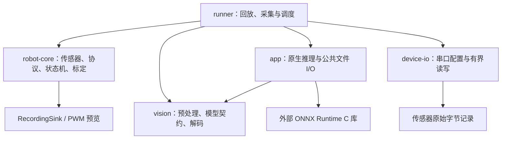

# 总体架构与实现审查（2026-09-08）

审查基线为 `6c7de79`，开始前已 fetch 确认本地与远端 main 一致，工作区干净。
本次检查覆盖 5 个 Rust crate、两套 CLI、协议/安全状态机、串口采集、视觉推理及构建交付脚本。
未接车、未操作真实设备、未读取视频，未执行任何目标平台二进制。

## 架构结论

当前分层适合作为 **Rust 为主的离线验证和设备接入基础**，没有必要整体推倒重写。
传感器协议、单位/坐标/时间校验与状态机不依赖串口或推理引擎；外部 I/O 和 ORT 会话在上层组合，
没有发现 crate 依赖环。串口实现使用安全 Rust 封装，应用侧禁止 unsafe；原生推理通过锁定的 ORT C API 边界调用。

图中的箭头描述依赖和输出用途，不代表程序已经形成实时自动驾驶闭环。
当前 YOLO 检测结果写入日志和传感器摘要；速度/曲率来自回放的 Motion 事件，尚没有从感知到规划控制的自动决策。

## 确认的问题与修复

### 静态文件读取策略不一致

前轮给 runner 修复了非普通文件与读取量限制，但 app 仍使用普通 `File::open` / `fs::read`。
使用没有写端的 FIFO 作为配置、图片、张量、模型或 provenance，可让程序一直等待；原生推理超时不覆盖这段输入读取。
这是可复现的实现缺陷，并非实际模型运行慢。

将文件打开和受限读取集中到 `crates/app/src/file_io.rs`，两套 CLI 共用；runner 保留原 API 的重新导出。
通过非阻塞打开后检查实际文件句柄，拒绝 FIFO 等非普通文件，并限制实际读取量。
图像尺寸检查与解码使用同一已验证句柄。统一实现避免两个入口对相同文件类型采取不同策略。
Python 独立模型校验与参考 worker 也改用非阻塞普通文件打开和实际读取量限制，
配置≤1MiB、模型≤64MiB，输入张量必须恰好为契约要求的字节数。

### 视觉输出路径保护不完整

视觉程序此前可将输出路径上的 FIFO 替换为普通报告文件；Python 参考后端的路径冲突检查还遗漏了解释器，
将报告输出设为显式解释器路径可覆盖该文件。原子替换只能避免半成品，不能替代输入与输出身份检查。
修复要求输出为普通文件目标，并将实际解释器纳入受保护输入。
解析解释器时保留虚拟环境符号链接，不把它替换为基础解释器；PATH 未设置时裸命令明确要求改用显式路径，
避免误把系统默认搜索路径变成当前目录。显式空 PATH 则保留当前目录搜索语义。
参考 worker 成功退出却留下 FIFO 结果时，读取同样立即失败；独立 worker 也拒绝替换 FIFO 输出。

### 雷达派生角度可能溢出

`angle_min_rad` 与 `angle_increment_rad` 都有限，不代表最后一束角度也有限。
例如两者都是 `1e308`、有两束回波时，末束角度为 `Inf`；原校验仍接受，Controller 可把它当作有效传感器数据。

现在同时检查角跨度和末束角度有限，空数组计算避免下溢。非法几何使 Controller 进入锁存 Fault/Stop；
保留正常负角增量、N10 跨零与单束输入，不加入未经测量的任意物理角度限制。

### ELF 版本核验未绑定实际加载视图

原检查器从 section 表读取版本需求和符号信息。构造 ELF 副本时，将实际加载的 GLIBC 需求改为 2.39，
另附旧字符串表并只修改 section 指向，原检查仍报告通过和最高版本 2.34。

修复将用于版本判断的元数据与 `PT_DYNAMIC` / `PT_LOAD` 所指向的实际表对应核对，拒绝不一致或含糊布局。
交付验证必须读取同一加载视图，不能只凭 section 名称、偏移或独立字符串证明 ABI 兼容。
测试仅修改 work 中的副本；没有修改或运行目标程序来构造复现。
检查包含没有未定义符号引用的 verneed 项，依据为 [ELF 动态表定义](https://gabi.xinuos.com/elf/08-dynamic.html)
和 [glibc 2.38 版本检查实现](https://github.com/bminor/glibc/blob/glibc-2.38/elf/dl-version.c)。
这仍是面向本工程产物布局的架构/ABI 基础核验，不是完整 ELF 加载器或全部指令集验证。

检查器文件入口另有 FIFO 阻塞和 `--output` 可覆盖输入二进制的问题，现已拒绝非普通输入、限定实际读取量，
输出检查规范路径/同 inode，并在检查通过后原子提交报告；检查或写出失败保留既有报告。
交付测试另修复新克隆没有 `tmp/` 时误报失败，未构建目标时按预期 skip。

## 本次未发现可复现缺陷的关键路径

- Controller 在接收迟到的心跳、指令和传感器前检查既有超时，Fault 不能被后续正常样本自动清除。
- 急停锁存；复位要求释放 deadman，清除旧指令/心跳/传感器状态。
- IMU/N10 保留分片首字节时间和有界缓存；坏帧不刷新状态，N10 无效点保留槽位。
- 标定表构造检查单调性、零锚点和范围，运行时拒绝外推；失败先停止，不记录为成功的 Drive。
- 串口非阻塞 poll、整体包截止时间与故障锁存衔接正确；采集 raw/空闲/结束事件共用单调纪元。
- 默认采集计划不打开配置中的设备；成功后原子发布日志，失败保留既有完整日志。
- YOLO 模型使用固定来源/哈希/元数据和张量契约；原生与 Python 参考后端的选择明确。

这些结论基于本次代码审查和测试范围，不是不存在其他缺陷的保证。

## 尚未完成的系统能力

这些属于工程阶段限制，需要后续实现，不能用现有测试通过来代替：

| 能力 | 当前状态与下一步 |
|---|---|
| 赛项任务与视觉语义 | 缺斑马线、锥桶、灯色与终点判定；需独立任务状态机管理停足3秒、等绿灯和事件去重，与安全 Fault 分层 |
| 实时调度 | 回放使用模拟时间，推理同步执行；接物理输出前须让控制周期和看门狗独立于可能阻塞的推理/日志，并限制排队数据年龄 |
| 多传感器时间与 TF | 独立采集文件各有纪元；尚无同时采集、时钟对齐、安装外参及车体坐标转换 |
| 激光有效覆盖 | 目前每包 16 束局部数据，需全圈组帧、丢包/覆盖质量检查，不能以“雷达新鲜”推断无障碍 |
| 定位、规划与避障 | 只有数据类型和安全门控；尚无激光里程计/融合定位、路径规划和碰撞判断，官方资料说明无轮编码器 |
| 底盘物理执行 | 只有编码和模拟标定预览；实际 PWM/速度/曲率/停车、ESC 行为、MCU 反馈/watchdog 与控制源仲裁待确认 |
| 目标推理 | Mac 原生推理已验证，RISC-V ORT/EP 仍待目标 API、算子、依赖和性能验证；协作取消不保证任意原生库硬实时退出 |

继续开发可以保留当前分层。接车前先完成独立实时调度设计；用户提供新车条件后，再按系统/只读传感器、
时间与坐标、标定和停车验证、定位规划的顺序推进。当前“暂不接车”的范围保持不变。
用户新提供的规则初稿已完整核对，要求与现有模块逐项见 [赛项三规则与工程差距](赛项三规则与工程差距.md)。
现有模型的 `traffic light` 只表示灯体，`zebra` 是动物；不能把通用80类推理通过写成赛项感知已完成。

## 验证结果

`scripts/build-riscv.sh --offline` 完整通过 fmt、全 workspace **100 项常规 Rust 测试**、
clippy `-D warnings` 与两个目标程序交叉链接。全套默认有1项依赖真实模型的测试 ignored；
本轮另显式提供 Mac ORT/ONNX 运行该项，实际通过，未将 ignored 算作通过。

- [构建与常规测试日志](architecture-build.log)、[原生模型 opt-in 测试](architecture-native-tests.log)。
- Python 模型/worker **48 项**通过，涵盖输入类型/大小、FIFO 与输出协议；[测试日志](architecture-model-tests.log)。
- ELF/交付 **34 项**通过，涵盖动态表伪装、表截断、重叠加载、FIFO、报告别名覆盖和新克隆；[测试日志](architecture-delivery-tests.log)。
- [原生/Python 真实模型对照](architecture-backend-parity.json)：本机 bus.jpg 的5个检测框完全一致，显式虚拟环境解释器正常执行。
- [机器人真实图片回放](architecture-robot-reference.json)：19事件、同一 Session 的2帧各5框，坏图非零退出并保存完整锁存急停；没有真实设备输出。

### 当前交叉构建

Rust 1.97.1、Zig 0.15.2、cargo-zigbuild 0.23.4，目标固定 `riscv64gc-unknown-linux-gnu.2.38`。
两程序均为 ELF64 LE RISC-V / RVC / LP64D / PIE，加载器 `/lib/ld-linux-riscv64-lp64d.so.1`，
动态版本需求最高 GLIBC 2.34，符合2.38基线。未升级车端 GLIBC，未执行目标文件。

| 程序 | 字节数 | DT_NEEDED | SHA256 |
|---|---:|---|---|
| `xt-stcar` | 1,216,656 | `libc.so.6` | `dee5340b31c8d1f49cd111f52a6e27962dc56a25c201be247d32f9a472d39a9e` |
| `xt-stcar-robot` | 1,470,352 | `libm.so.6, libc.so.6` | `382a9d8cc1ac76b940b04e15e623cd70a36d7e0494607f3e5f726cc97355b870` |

[构建来源记录](architecture-riscv-build.json) 保存42个 Rust 源码/清单/锁文件哈希；
[视觉 ELF](architecture-riscv-elf.json)、[机器人 ELF](architecture-robot-elf.json) 保存实际加载表与版本结果。
本节及 `architecture-*` 是当前证据；旧 `rust-expansion-*` 和其他日期报告保留为历史。

### 当前部署包

两种包由本轮产物重新生成，复制到当前任务 outputs 后再验证全部成员、白名单、ELF、manifest和SHA256。
原包保留在 `dist/`；[交付核验](architecture-delivery-validation.json) 记录实际路径与完整 manifest。

| 包 | 字节数 | 文件数 | SHA256 |
|---|---:|---:|---|
| `XT-STCAR-architecture-core-2026-09-08.tar.gz` | 1,456,683 | 28 | `5e375684ac2973845339889a11516e7eab77dd7197b3fd12aa47586adb94fc29` |
| `XT-STCAR-architecture-YOLO26n-2026-09-08.tar.gz` | 10,101,682 | 32 | `3fa3b86f79fefe63da57b2a73c862944d7494fe66ac33e52e80428c3312f83a9` |

包不含工具链、虚拟环境、缓存、Mac 原生库或 RISC-V ORT 库；含模型包附来源/静态校验与许可。
源码、文档和验证记录按上传规范直接提交 main；部署包和规则 PDF 原件留本机，未上传车辆。
